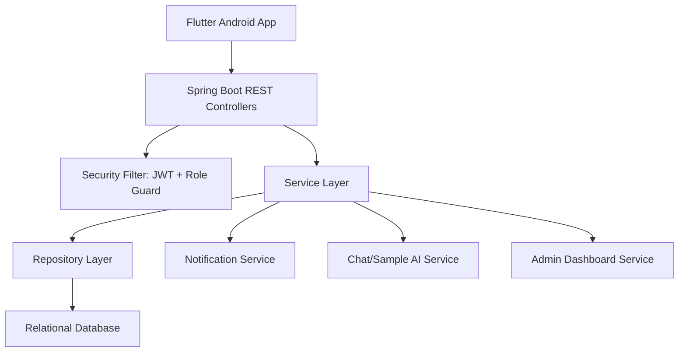
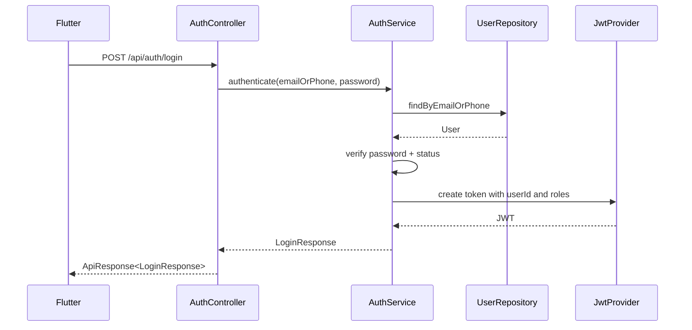

# MarineLink Backend Architecture

Nguồn: `docs/MarineLink_Main_Functions_Specification_v3.docx` và `docs/MarineLink_Sprint_Planning.md`

## 1. Mục tiêu

Tài liệu này mô tả kiến trúc backend Spring Boot REST API cho MarineLink. Backend phục vụ Flutter Android app, quản lý xác thực, sản phẩm, giỏ hàng, đơn hàng, chat, thông báo, kho hàng, hồ sơ và Full Admin Dashboard.

Mục tiêu backend:

- Cung cấp REST API đúng contract cho Flutter.
- Dùng JWT Bearer token và phân quyền Admin, Staff, User/Đại lý.
- Quản lý dữ liệu quan hệ theo docx và DB design hiện tại: users, roles, categories, products, product_images, price_tiers, carts, cart_items, orders, order_items, order_status_history, chat_rooms, chat_messages, chat_attachments, complaints, notifications, warehouses.
- Hỗ trợ mock-first frontend: API có thể triển khai sau nhưng phải giữ endpoint và DTO ổn định.
- Cung cấp sample AI responses cho demo phase, chưa cần tích hợp model thật.

## 2. Quyết định kiến trúc

| Chủ đề | Quyết định |
|---|---|
| Backend framework | Spring Boot REST API |
| Architecture style | Modular monolith, feature/domain-based |
| API style | REST, JSON, consistent response envelope |
| Auth | JWT Bearer token |
| Authorization | Role-based: roles stored in database, không dùng cột role trực tiếp trong `users` |
| Persistence | Relational database with JPA/Hibernate |
| ID model | Internal `bigint id` for DB PK/FK/index; external UUIDv4 `public_id` for API |
| Repo location | Spring Boot code nằm trong `backend/` của monorepo |
| API contract | BE triển khai đúng `docs/MarineLink_API_Documentation.md` và giữ contract test |
| Admin scope | Full Admin Dashboard |
| AI support demo | Rule-based sample responses |
| Google login | Out of MVP unless OAuth provider, callback flow, and account linking are explicitly added |
| Frontend integration | Flutter repository layer switches from mock to remote API |

## 3. Tổng quan hệ thống



Backend nên là modular monolith thay vì microservices vì scope nhóm 3 người, thời gian sprint 1 tuần và hệ thống đang ở giai đoạn demo/MVP. Mỗi domain có controller, service, repository, DTO và entity riêng.

## 4. Package structure đề xuất

```text
backend/
  pom.xml
  src/main/java/com/marinelink/
    MarineLinkApplication.java
    config/
      SecurityConfig.java
      WebConfig.java
      OpenApiConfig.java
    common/
      api/
        ApiResponse.java
        PageResponse.java
        ErrorResponse.java
      exception/
        GlobalExceptionHandler.java
        BusinessException.java
      security/
        JwtAuthenticationFilter.java
        JwtTokenProvider.java
        CurrentUser.java
      validation/
    auth/
      AuthController.java
      AuthService.java
      dto/
    users/
      User.java
      Role.java
      UserRepository.java
      UserService.java
      UserController.java
      dto/
    products/
      Product.java
      Category.java
      PriceTier.java
      ProductRepository.java
      ProductService.java
      ProductController.java
      dto/
    cart/
      Cart.java
      CartItem.java
      CartController.java
      CartService.java
      dto/
    orders/
      Order.java
      OrderItem.java
      OrderRepository.java
      OrderService.java
      OrderController.java
      dto/
    notifications/
      Notification.java
      NotificationService.java
      NotificationController.java
    messaging/
      ChatMessage.java
      ChatAttachment.java
      Complaint.java
      MessagingService.java
      MessagingController.java
    warehouses/
      Warehouse.java
      WarehouseService.java
      WarehouseController.java
    admin/
      AdminController.java
      AdminDashboardService.java
      dto/
  src/main/resources/
    application.yml
    db/migration/
  src/test/java/com/marinelink/
```

Quy ước trong monorepo:

- Không đặt Spring Boot project ở root repo để tránh xung đột với Flutter tooling.
- Không commit `target/`, `.env`, database password, JWT secret, hoặc Supabase service role key.
- Backend là source of truth cho authorization và business rule; Flutter không tự kiểm tra quyền thay cho backend.
- Contract test trong `backend/src/test/` phải xác nhận response envelope, status code và DTO field khớp tài liệu API.

## 5. API response envelope

Tất cả API trả response thống nhất:

```json
{
  "success": true,
  "data": {},
  "message": "OK",
  "pagination": {
    "page": 0,
    "size": 20,
    "totalElements": 100,
    "totalPages": 5
  }
}
```

Error response:

```json
{
  "success": false,
  "data": null,
  "message": "Validation failed",
  "errors": [
    {
      "field": "email",
      "message": "Email không hợp lệ"
    }
  ]
}
```

Frontend chỉ cần parse một response format, giảm xử lý đặc biệt ở từng màn hình.

## 6. Domain model

| Entity | Mục đích | Quan hệ chính |
|---|---|---|
| User | Tài khoản người dùng | n-1 role, 1-n orders, chat_messages, complaints, notifications |
| Role | Vai trò như Admin, Staff, User | 1-n users |
| Product | Sản phẩm hải sản | n-1 category, 1-n product_images, 1-n order_items, 1-n price_tiers |
| Category | Danh mục sản phẩm | 1-n products |
| PriceTier | Giá sỉ theo số lượng | n-1 product, 1-n cart_items nếu cart đã chọn tier |
| Cart | Giỏ hàng hiện tại | n-1 user, 1-n cart_items |
| CartItem | Sản phẩm trong giỏ | n-1 cart, n-1 product, n-1 selected price_tier |
| Order | Đơn hàng đại lý | n-1 user, 1-n order_items, 1-n order_status_history, 1-n complaints |
| OrderItem | Dòng sản phẩm trong đơn | n-1 order, n-1 product |
| ChatMessage | Lịch sử chat | n-1 user, 1-n chat_attachments, 1-n complaints nếu message tạo khiếu nại |
| ChatAttachment | File đính kèm trong chat | n-1 chat_message, n-1 uploaded_by user |
| Complaint | Khiếu nại | n-1 user, n-1 order, n-1 chat_message nếu phát sinh từ chat |
| Notification | Thông báo | n-1 user |
| Warehouse | Kho/điểm giao nhận | Độc lập, dùng cho map |

## 7. Trạng thái và enum chính

```text
UserStatus:
  PENDING_APPROVAL
  ACTIVE
  DISABLED

OrderStatus:
  PENDING
  CONFIRMED
  SHIPPING
  COMPLETED
  CANCELLED

PaymentMethod:
  COD
  BANK_TRANSFER

NotificationType:
  PROMOTION
  PRODUCT
  ORDER
  CHAT

ChatSenderType:
  USER
  STAFF
  AI_SAMPLE
```

## 8. REST endpoints

| Method | Endpoint | Mô tả | Role |
|---|---|---|---|
| POST | `/api/auth/login` | Đăng nhập | Public |
| POST | `/api/auth/register` | Đăng ký đại lý | Public |
| POST | `/api/auth/logout` | Logout/token cleanup nếu cần | Authenticated |
| GET | `/api/users/me` | Xem hồ sơ | Authenticated |
| PUT | `/api/users/me` | Cập nhật hồ sơ | Authenticated |
| GET | `/api/products` | Danh sách, search, filter, sort | All roles |
| GET | `/api/products/{id}` | Chi tiết sản phẩm + price tiers | All roles |
| POST | `/api/cart/sync` | Đồng bộ giỏ hàng | User |
| POST | `/api/orders` | Tạo đơn hàng | User |
| GET | `/api/orders` | Danh sách đơn theo role/trạng thái | All roles |
| GET | `/api/orders/{id}` | Chi tiết đơn | Owner, Staff, Admin |
| PUT | `/api/orders/{id}/status` | Cập nhật trạng thái đơn | Staff, Admin |
| POST | `/api/chat/send` | Gửi tin nhắn | All roles |
| GET | `/api/chat/{roomId}` | Lịch sử chat | Participant, Staff, Admin |
| GET | `/api/notifications` | Danh sách thông báo | Authenticated |
| PUT | `/api/notifications/{id}/read` | Đánh dấu đã đọc | Owner |
| GET | `/api/warehouses` | Danh sách kho | All roles |
| GET | `/api/admin/dashboard` | Thống kê tổng quan | Admin |
| CRUD | `/api/admin/products` | Quản lý sản phẩm | Admin |
| CRUD | `/api/admin/users` | Quản lý tài khoản | Admin |

## 9. Layer responsibilities

| Layer | Trách nhiệm |
|---|---|
| Controller | Nhận request, validate DTO, gọi service, trả ApiResponse |
| Service | Business logic, transaction, authorization bổ sung, orchestration |
| Repository | JPA query, filter, pagination, persistence |
| Entity | Mapping database, quan hệ, enum |
| DTO | Request/response contract với Flutter |
| Mapper | Convert Entity <-> DTO |
| Security | JWT parsing, authentication, role guard |
| Exception handler | Map exception thành error response thống nhất |

Controller không chứa business logic. Repository không trả entity trực tiếp ra API. Service là nơi xử lý rule như kiểm tra tồn kho, trạng thái đơn hợp lệ, quyền cập nhật.

## 10. Authentication và authorization

Login flow:



Authorization rules:

- User/Đại lý chỉ xem và thao tác đơn hàng của chính mình.
- Staff có thể xem đơn mới, cập nhật trạng thái đơn, phản hồi chat.
- Admin có toàn quyền dashboard, sản phẩm, người dùng, đơn hàng.
- Public chỉ được login/register và xem endpoint công khai nếu có yêu cầu demo.
- Role được liên kết trực tiếp với `users` qua cột `role_id`; mỗi user chỉ thuộc về một role tại một thời điểm.

## 11. Business rules theo module

### Auth

- Login bằng email hoặc số điện thoại.
- Register tạo user status `PENDING_APPROVAL` hoặc `ACTIVE`, sau đó gán role mặc định `USER` qua cột `role_id`.
- Password phải hash bằng BCrypt.
- JWT phải có expiration.
- Đăng nhập Google trong specification được xem là out of MVP. MVP chỉ hỗ trợ email/số điện thoại + password; nếu thêm Google OAuth sau này phải bổ sung endpoint, callback, account linking và test phân quyền riêng.

### Products

- Product list hỗ trợ category, keyword, price range, stock status, sort.
- Product detail trả price tiers.
- Admin có thể create/update/delete hoặc disable product.
- Không xóa cứng sản phẩm nếu đã có order item; dùng soft delete/status.

### Cart

- Frontend có thể giữ cart local để thao tác nhanh.
- `/api/cart/sync` đồng bộ vào `carts` + `cart_items`, validate product tồn tại, còn hàng, min quantity và price tier.
- Backend giữ một cart active cho mỗi user; checkout thành công thì xóa hoặc clear `cart_items`.

### Orders

- Create order phải kiểm tra:
  - Cart không rỗng.
  - Product còn hàng.
  - Quantity đạt min quantity.
  - Receiver phone/address hợp lệ.
  - Payment method hợp lệ.
- Khi tạo order, snapshot price vào `order_items` để đơn không đổi khi giá sản phẩm thay đổi.
- Status transition hợp lệ:
  - PENDING -> CONFIRMED hoặc CANCELLED
  - CONFIRMED -> SHIPPING hoặc CANCELLED
  - SHIPPING -> COMPLETED
  - COMPLETED không đổi
  - CANCELLED không đổi
- Khi status đổi, tạo notification cho user.

### Messaging

- Không nhận tin nhắn rỗng.
- Lưu lịch sử chat và file đính kèm qua `chat_attachments`.
- Phân biệt sender type: USER, STAFF, AI_SAMPLE.
- File chat lưu metadata trong database, còn binary lưu ở Supabase Storage bucket `chat-attachments`.
- Demo phase dùng sample response theo keyword:
  - "giá", "price" -> trả lời về giá sỉ/price tier.
  - "tồn kho", "stock" -> trả lời về trạng thái tồn kho.
  - "đơn hàng", "order" -> trả lời hướng dẫn xem orders.

### Notifications

- Tạo notification khi:
  - Order được tạo.
  - Order status thay đổi.
  - Có phản hồi chat.
  - Admin tạo khuyến mãi/sản phẩm mới nếu có.
- User chỉ đọc notification của mình.

### Admin Dashboard

Full Admin Dashboard gồm:

- Overview cards: số đơn, doanh thu mẫu, số sản phẩm, số user.
- Product management: list/create/update/delete hoặc disable, stock/status.
- User management: danh sách user, duyệt đại lý, cập nhật role/status.
- Order management: xem đơn, lọc trạng thái, cập nhật trạng thái.
- Support management: xem chat, phản hồi đại lý, complaint handoff cơ bản.

## 12. Database design notes

Database dùng `id bigint generated by default as identity` làm khóa chính thật để tối ưu primary key index, foreign key join và cursor pagination nội bộ. Mỗi resource có thêm `public_id uuid default gen_random_uuid()` để trả ra API như ID giả. Backend không expose `id bigint`; mọi request từ Flutter dùng UUIDv4 public ID rồi service/repository resolve về `id bigint` trước khi query.

Index đề xuất:

| Table | Index |
|---|---|
| users | email unique, phone unique, status, role_id |
| roles | role code unique |
| products | category_id, name, status, stock_quantity |
| carts | user_id |
| cart_items | cart_id, product_id, price_tier_id |
| orders | user_id, status, created_at |
| order_items | order_id, product_id |
| notifications | user_id, is_read, created_at |
| chat_messages | user_id, created_at |
| chat_attachments | message_id, uploaded_by, created_at |
| complaints | user_id, order_id, chat_message_id, status |
| warehouses | latitude, longitude |

Transaction bắt buộc:

- Create order + order items + notification.
- Update order status + notification.
- Admin product update nếu ảnh hưởng stock/status.

## 13. Validation và security

- Dùng Bean Validation cho request DTO.
- Không trust input từ Flutter.
- Không hardcode secrets trong source.
- JWT secret đọc từ environment variable.
- Không trả password hash trong response.
- Error response không lộ stack trace.
- CORS chỉ mở origin cần thiết trong môi trường production.
- Rate limit endpoint login/register nếu có thời gian triển khai.

## 14. Testing strategy

| Test type | Scope |
|---|---|
| Unit test | Service business rules, status transition, sample AI response |
| Repository test | Query products/orders/users với filter |
| Integration test | Auth, create order, update order status, admin dashboard |
| Security test | Role guard, owner-only order access, invalid token |
| API contract test | Response envelope và DTO field matching Flutter |

Coverage gate:

- Unit, repository, integration, security và API contract tests should target at least 80% coverage for implemented backend code.
- Before PR/demo, run `mvn clean verify` and the configured coverage report, for example JaCoCo if enabled.
- If coverage is temporarily below 80%, the sprint note must list uncovered modules, risk, owner, and target fix date.

Critical test cases:

- Login success/failure.
- Register duplicate email/phone.
- Product list filter by category and keyword.
- Checkout rejects empty cart and invalid quantity.
- Create order stores price snapshot.
- User cannot update order status.
- Staff/Admin can update order status.
- User cannot read another user's order.
- Notification created on status change.
- Admin dashboard returns overview data.

## 15. Spring configuration

Recommended config keys:

```yaml
spring:
  datasource:
    url: ${DB_URL}
    username: ${DB_USERNAME}
    password: ${DB_PASSWORD}
  jpa:
    hibernate:
      ddl-auto: validate
    properties:
      hibernate:
        format_sql: true

app:
  jwt:
    secret: ${JWT_SECRET}
    expiration-minutes: 1440
  cors:
    allowed-origins: ${CORS_ALLOWED_ORIGINS:http://localhost:3000}
```

Trong giai đoạn demo có thể dùng `ddl-auto: update`, nhưng trước khi nộp hoặc deploy nên chuyển sang migration tool như Flyway/Liquibase hoặc script SQL có kiểm soát.

## 16. Implementation phases

| Phase | Scope |
|---|---|
| Phase 1 | Auth, user model, JWT, role guard |
| Phase 2 | Products, categories, price tiers |
| Phase 3 | Orders, order items, checkout validation, notifications |
| Phase 4 | Messaging, chat attachments, sample AI responses, warehouses |
| Phase 5 | Full Admin Dashboard |
| Phase 6 | API contract hardening, tests, integration with Flutter |

## 17. Backend definition of done

- [ ] API endpoints match frontend contract.
- [ ] JWT auth and role guard working.
- [ ] All request DTOs validate inputs.
- [ ] Error response follows envelope format.
- [ ] Product browsing endpoints support search/filter/sort.
- [ ] Order creation and status transition are transactional.
- [ ] Notifications are generated for order status changes.
- [ ] Chat stores messages, attachments, and returns sample responses for demo.
- [ ] Full Admin Dashboard APIs implemented.
- [ ] Critical service and security tests pass.
