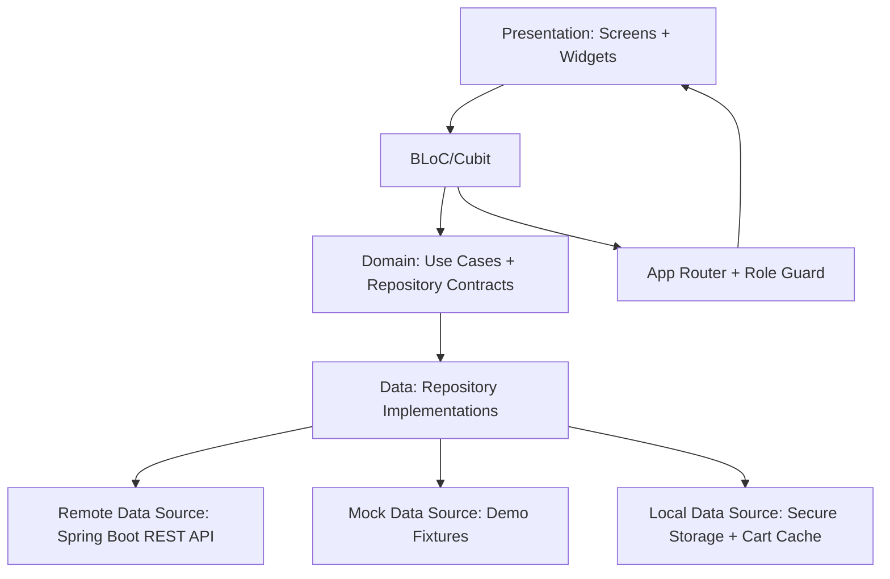
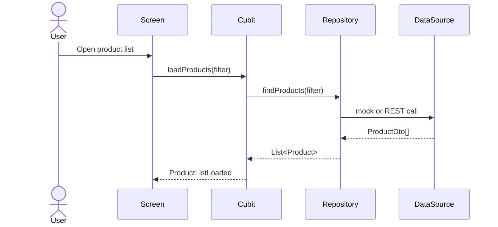
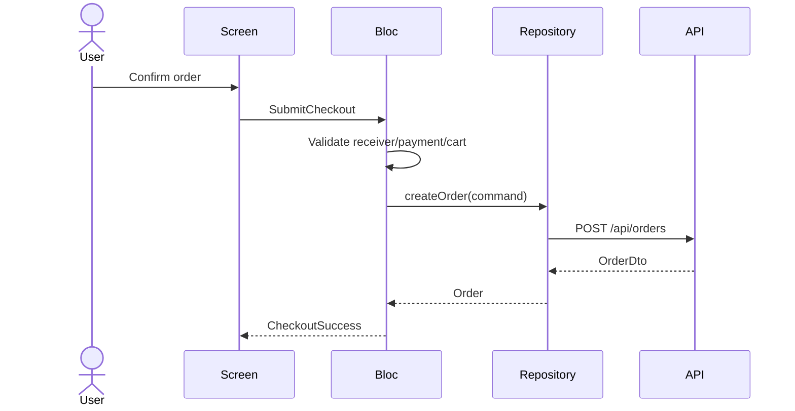

# MarineLink Frontend Architecture

Nguồn: `docs/MarineLink_Main_Functions_Specification_v3.md` và `docs/MarineLink_Sprint_Planning.md`

## 1. Mục tiêu

Tài liệu này mô tả kiến trúc Flutter Android cho MarineLink, một ứng dụng B2B giúp đại lý hải sản xem sản phẩm, đặt hàng, theo dõi đơn, chat hỗ trợ và tương tác với Admin/Staff.

Mục tiêu frontend:

- Demo được luồng chính: Login -> Home -> Product List -> Product Detail -> Cart -> Checkout -> Orders -> Notifications/Chat.
- Dùng mock data trước để không bị chặn bởi backend.
- Sau đó đổi repository implementation sang Spring Boot REST API mà không phải viết lại UI.
- Dùng BLoC/Cubit thống nhất: Cubit cho màn hình đơn giản, BLoC cho flow phức tạp.
- Hỗ trợ đủ role: User/Đại lý, Staff/Nhân viên, Admin.

## 2. Quyết định kiến trúc

| Chủ đề | Quyết định |
|---|---|
| Platform | Flutter Android |
| State management | BLoC/Cubit |
| Data source giai đoạn đầu | Mock repository + local storage |
| Data source giai đoạn sau | Spring Boot REST API |
| Auth | JWT Bearer token |
| Role | Resolve từ backend qua `roles` liên kết trực tiếp với `users`; app chỉ dùng role trong JWT/session |
| Repo location | Flutter code nằm trong `frontend/` của monorepo |
| API contract | FE chỉ bám `docs/MarineLink_API_Documentation.md`, không tự phát sinh endpoint riêng |
| Admin scope | Full Admin Dashboard |
| Chat support demo | Chat trực tiếp với Nhân viên hỗ trợ |

## 2A. UI source of truth

- UI source of truth là Flutter source code trong `frontend/lib/`.
- Design tokens (màu, typography, border radius, spacing) được định nghĩa trong `frontend/lib/app/theme/app_theme.dart`.
- Ảnh demo sản phẩm nằm trong `frontend/assets/product_images/` (tôm khô, mực khô, cá sọc vàng, mực mềm).
- Screen mapping:
  - `frontend/lib/features/home/presentation/screens/home_screen.dart`
  - `frontend/lib/features/products/presentation/screens/product_list_screen.dart`
  - `frontend/lib/features/products/presentation/screens/product_detail_screen.dart`
  - `frontend/lib/features/notifications/presentation/screens/notifications_screen.dart`
- Catalog app đang dùng `ProductMockRepository`; chuyển sang remote repository ở Sprint 5 khi tích hợp API.

## 3. Tổng quan kiến trúc



Frontend đi theo hướng feature-first, tách rõ presentation, domain và data. UI chỉ biết gọi BLoC/Cubit. BLoC/Cubit gọi use case hoặc repository contract. Repository contract có thể được implement bằng mock data hoặc REST API.

## 4. Layer chính

| Layer | Trách nhiệm | Không nên làm |
|---|---|---|
| Presentation | Screen, widget, form, loading/empty/error/success state | Không gọi HTTP trực tiếp |
| BLoC/Cubit | Quản lý state, xử lý event, gọi use case/repository | Không chứa code render UI |
| Domain | Entity, use case, repository interface, business rule nhẹ | Không phụ thuộc Flutter widget |
| Data | DTO, mapper, repository implementation, API client, mock data | Không xử lý điều hướng UI |
| Core | Theme, constants, error model, result type, validators, router, DI | Không chứa logic riêng của một feature |

## 5. Cấu trúc thư mục đề xuất

```text
frontend/
  pubspec.yaml
  analysis_options.yaml
  lib/
    main.dart
    app/
      app.dart
      router/
        app_router.dart
        route_guard.dart
      theme/
        app_theme.dart
      di/
        service_locator.dart
    core/
      api/
        api_client.dart
        api_endpoints.dart
        api_response.dart
      errors/
        app_exception.dart
        failure.dart
      storage/
        secure_token_storage.dart
        cart_local_storage.dart
      utils/
        validators.dart
        money_formatter.dart
    features/
      auth/
        data/
        domain/
        presentation/
      home/
      products/
      cart/
      checkout/
      orders/
      notifications/
      messaging/
      profile/
      warehouse_map/
      admin/
    shared/
      widgets/
      models/
  test/
  integration_test/
  android/
```

Mỗi feature có cấu trúc nhỏ:

```text
features/products/
  data/
    product_dto.dart
    product_mapper.dart
    product_mock_repository.dart
    product_remote_repository.dart
  domain/
    product.dart
    product_repository.dart
  presentation/
    bloc/
      product_list_cubit.dart
      product_detail_cubit.dart
    screens/
    widgets/
```

Quy ước trong monorepo:

- Không đặt code Flutter ở root repo để tránh lẫn với Spring Boot.
- Không commit `build/`, `.dart_tool/`, file keystore, token, hoặc output coverage lớn.
- `frontend/lib/core/api/api_endpoints.dart` chỉ mirror endpoint đã có trong `docs/MarineLink_API_Documentation.md`.
- `frontend/test/` chứa unit/BLoC/widget test; `frontend/integration_test/` chứa luồng demo chính.

## 6. Feature modules

| Feature | State manager | Scope |
|---|---|---|
| Auth | BLoC | Login, register, JWT, role routing, logout |
| Home | BLoC | Buyer dashboard hero, category rail, featured products, quick search, notifications entry |
| Products | BLoC | Product list, quick filter chips, advanced filter bottom sheet, product detail, price tiers, add-to-cart temporary flow |
| Cart | Cubit | Add/update/remove/clear item, selected items, total calculation, empty cart; khi dùng remote thì server Cart API là source of truth, Cubit là UI cache |
| Checkout | BLoC | Validate receiver info, payment method, selected cart items, create order through `CheckoutRepository`, success/error state, clear cart UI cache |
| Orders | BLoC | List/detail, status tracking, role-based status update |
| Notifications | Screen/Cubit | Buyer notifications list now has UI shell; unread state + mark-as-read stay for API integration phase |
| Messaging | BLoC | Chat history, send message, chat attachments, staff response |
| Profile | Cubit | View/update profile, change password placeholder |
| Warehouse Map | Cubit | Warehouse markers, open Google Maps, permission state |
| Admin | BLoC | Dashboard, products CRUD, users, orders, staff chat |

## 7. Data flow

### 7.1 Read flow



Product List filter state:

| Field | FE usage | API mapping |
|---|---|---|
| `query` | Search field; submit hoặc bấm search button để tải lại list | `q` |
| `categoryId` | Chip danh mục ở hàng filter nhanh | `categoryId` |
| `stockFilter` | `Tất cả`, `Còn hàng`, `Sắp hết`; `Sắp hết` tính từ `stockQuantity <= minOrderQuantity * 6` | MVP lọc local trên response `ACTIVE`; backend mở rộng nếu cần |
| `sort` | Bottom sheet hoặc sort chip: mặc định, mới nhất, tên A-Z/Z-A, giá tăng/giảm | `newest`, `price_asc`, `price_desc`, `name_asc`, `name_desc` |

Không đưa filter khoảng giá, MOQ hoặc xuất xứ vào UI production trước khi `docs/MarineLink_API_Documentation.md` và `docs/marinelink_openapi.json` có contract tương ứng.

### 7.2 Write flow



Current FE local implementation uses `CheckoutScreen` + `CheckoutBloc` + `OrderCheckoutRepository`. The repository adapts to `OrderRepository.createOrder` and preserves the `POST /api/orders` contract shape. Until S2-08/S5-03 implements Cart remote/server-side source of truth, checkout validates `CartCubit` local/UI cache; backend still must revalidate active cart, stock, min quantity, price tier and clear `cart_items` transactionally.

## 8. API integration strategy

Frontend không gọi endpoint trực tiếp từ UI. Mỗi module có repository interface:

```dart
abstract class ProductRepository {
  Future<List<Product>> findProducts(ProductFilter filter);
  Future<ProductDetail> findProductById(String productId);
}
```

Giai đoạn mock:

- `ProductMockRepository` trả data từ fixture trong app.
- `AuthMockRepository` trả fake JWT và role.
- `OrderMockRepository` lưu đơn trong memory/local storage để demo.

Giai đoạn Spring Boot:

- `ProductRemoteRepository` gọi `/api/products` và `/api/products/{id}`.
- `AuthRemoteRepository` gọi `/api/auth/login`, `/api/auth/register`.
- `CartRemoteRepository` gọi Cart API thật để load/add/update/remove/clear cart item. Sau login, server cart là source of truth để đổi thiết bị vẫn thấy giỏ hàng.
- `/api/cart/sync` chỉ là endpoint phụ để merge cart local/offline/pre-login lên `carts` + `cart_items`; không dùng làm luồng add/update/remove chính.
- `OrderRemoteRepository` gọi `/api/orders`, `/api/orders/{id}`, `/api/orders/{id}/status`.
- `MessagingRemoteRepository` gọi `/api/chat/send`, `/api/chat/{roomId}` và xử lý metadata `chat_attachments`.
- DI quyết định dùng mock hay remote qua `--dart-define=USE_REMOTE_REPOSITORIES=true`.
- Khi test Android emulator với backend local, dùng thêm `--dart-define=API_BASE_URL=http://10.0.2.2:8080`; desktop/browser dùng `http://localhost:8080`.

## 9. Endpoint frontend cần dùng

| Feature | Endpoint | Method | Role |
|---|---|---|---|
| Auth login | `/api/auth/login` | POST | Public |
| Auth register | `/api/auth/register` | POST | Public |
| Auth logout | `/api/auth/logout` | POST | Authenticated |
| Products | `/api/products` | GET | All roles |
| Product detail | `/api/products/{id}` | GET | All roles |
| Cart load | `/api/cart` | GET | User |
| Cart add item | `/api/cart/items` | POST | User |
| Cart update item | `/api/cart/items/{productId}` | PATCH | User |
| Cart remove item | `/api/cart/items/{productId}` | DELETE | User |
| Cart clear | `/api/cart/items` | DELETE | User |
| Cart sync local/offline | `/api/cart/sync` | POST | User |
| Create order | `/api/orders` | POST | User |
| Orders | `/api/orders` | GET | User own orders; Staff/Admin scoped by role |
| Order detail | `/api/orders/{id}` | GET | Owner, Staff, Admin |
| Update order status | `/api/orders/{id}/status` | PUT | Admin, Staff |
| Chat send | `/api/chat/send` | POST | All roles |
| Chat history | `/api/chat/{roomId}` | GET | Participant, Staff, Admin |
| Notifications | `/api/notifications` | GET | All roles |
| Mark notification read | `/api/notifications/{id}/read` | PUT | Owner |
| Warehouses | `/api/warehouses` | GET | All roles |
| Profile | `/api/users/me` | GET/PUT | Authenticated |
| Admin dashboard | `/api/admin/dashboard` | GET | Admin |
| Admin products | `/api/admin/products` | CRUD | Admin |
| Admin users | `/api/admin/users` | CRUD | Admin |

## 10. Auth và role guard

Auth state gồm:

- `Unauthenticated`
- `Authenticating`
- `Authenticated(user, token, role)`
- `AuthFailure(message)`

Routing rules:

- Public routes: login, register.
- User routes: home, products, cart, checkout, orders, chat, notifications, profile, map.
- Staff routes: order processing, chat response.
- Admin routes: full dashboard, product management, user/role management, order status management.

JWT được lưu bằng secure storage. Không lưu password hoặc secret trong local storage.

## 11. State conventions

Mỗi screen phải có state tối thiểu:

- Initial
- Loading
- Loaded/Success
- Empty
- Failure

Các Cubit phù hợp cho state đơn giản:

- HomeCubit
- ProductListCubit
- ProductDetailCubit
- CartCubit
- NotificationCubit
- ProfileCubit
- WarehouseMapCubit

Các BLoC phù hợp cho flow có nhiều event:

- AuthBloc
- CheckoutBloc
- OrderBloc
- MessagingBloc
- AdminBloc

## 12. UI/UX requirements

- Màn hình phải rõ loading, empty và error state.
- Form login/register/checkout/profile phải validate tại client.
- Lỗi API hiển thị bằng text dễ hiểu, không show stack trace.
- Product card phải có ảnh, tên, xuất xứ, giá, số lượng tối thiểu, trạng thái tồn kho.
- Cart state phải cập nhật tổng tiền ngay khi thay đổi số lượng, tính lại price tier, xử lý selected items và cart rỗng.
- Admin UI ưu tiên bảng/list dễ quét, không dùng layout marketing.
- Demo data cần đủ thực tế: mực khô, tôm khô, cá khô, nước mắm, giá sỉ, tồn kho.

## 13. Error handling

Tất cả repository trả về domain result hoặc throw exception được map về failure:

- NetworkFailure
- UnauthorizedFailure
- ForbiddenFailure
- ValidationFailure
- NotFoundFailure
- ServerFailure
- UnknownFailure

BLoC/Cubit không hiển thị message backend thô nếu message có thể lộ thông tin nhạy cảm.

## 14. Testing strategy

| Test type | Scope |
|---|---|
| Unit test | Validators, mappers, money formatter, repository mock |
| BLoC/Cubit test | AuthBloc, CheckoutBloc, OrderBloc, AdminBloc, CartCubit |
| Widget test | Login form, product card, cart item, checkout form |
| Integration test | Demo flow chính với mock data |
| Manual test | Android emulator/device, role routing, map permission |

Coverage gate:

- Unit/BLoC/widget/integration tests should target at least 80% coverage for implemented app code.
- If the project cannot meet 80% during early scaffolding, the sprint note must list the uncovered modules and the owner/date to close the gap.
- Before demo or PR, run `flutter test --coverage` and keep the coverage report with the sprint evidence.

Luồng test demo bắt buộc:

1. Login User.
2. View home.
3. Search/filter product, including stock filter and price sort.
4. View product detail.
5. Add to cart.
6. Checkout and create order.
7. View order status.
8. Open notification or chat.
9. Login Admin/Staff.
10. Update order status in Admin Dashboard.

## 15. Implementation checklist

- [ ] Flutter app structure created.
- [ ] BLoC/Cubit dependencies added.
- [ ] Core API client and response envelope implemented.
- [ ] Mock repositories implemented for all P0 flows.
- [ ] AuthBloc with role guard implemented.
- [ ] Product browsing flow implemented with search, category chips, stock filter, price sort, empty state, and reset filter action.
- [x] Cart local state implemented with CartCubit add/update/remove/clear, totals, selected items, and empty cart handling.
- [ ] Cart screen implemented.
- [x] Checkout flow implemented with form validation, payment method, local cart validation, success/error state, order creation adapter, and cart UI cache clear.
- [ ] Orders and notifications implemented.
- [ ] Messaging with sample responses and chat attachment metadata implemented.
- [ ] Full Admin Dashboard implemented.
- [ ] Remote repositories integrated with Spring Boot API.
- [ ] Demo flow verified on Android.
