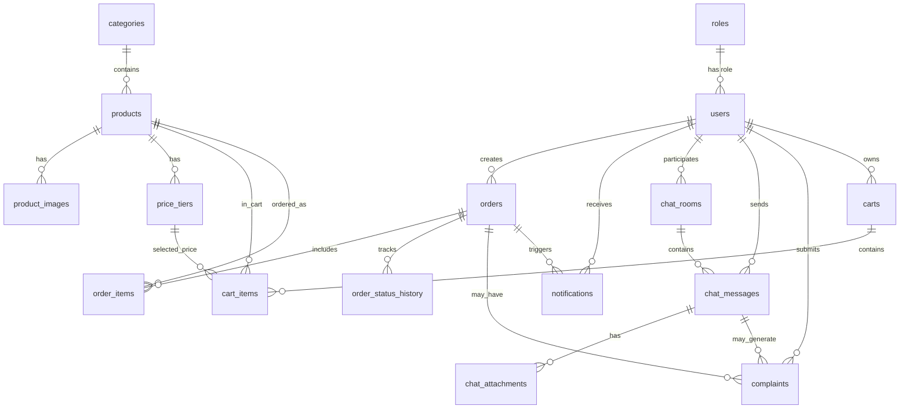

# MarineLink Supabase Database Design

Nguồn: `docs/MarineLink_Main_Functions_Specification_v3.docx`, `docs/MarineLink_BE_Architecture.md`, `docs/MarineLink_FE_Architecture.md`

## 1. Mục tiêu

Tài liệu này thiết kế database Supabase/PostgreSQL cho MarineLink. Supabase được dùng làm database chính, còn Spring Boot REST API là backend trung gian cho Flutter Android app.

Mục tiêu database:

- Lưu dữ liệu cho các module: auth/users/roles, catalog, carts, orders, notifications, messaging, complaints, warehouses, admin dashboard.
- Khởi tạo 3 role mặc định: `ADMIN`, `STAFF`, `USER`; có thể mở rộng thêm role bằng bảng `roles`.
- Phù hợp luồng demo: Login -> Product browsing -> Cart -> Checkout -> Orders -> Notifications/Chat -> Admin Dashboard.
- Tách rõ dữ liệu nghiệp vụ và dữ liệu phục vụ demo.
- Có constraint, index và migration plan để tránh lỗi dữ liệu khi tích hợp Spring Boot.

## 2. Quyết định thiết kế

| Chủ đề | Quyết định |
|---|---|
| Database | Supabase PostgreSQL |
| Backend access | Spring Boot kết nối DB bằng PostgreSQL connection string |
| Frontend access | Flutter không gọi Supabase trực tiếp trong MVP |
| Auth owner | Spring Boot tự xử lý login/register/JWT |
| Authorization model | Role-based với `roles` liên kết trực tiếp tới `users` qua `role_id` |
| Supabase Auth | Không dùng trong MVP; có thể tích hợp sau |
| Primary key | `id bigint generated by default as identity`; chỉ dùng nội bộ DB |
| Timestamp | `timestamptz` |
| Money/price | `numeric(12,2)` |
| Soft delete | Dùng `deleted_at` cho bảng nghiệp vụ quan trọng |
| RLS | Bật policy phòng thủ nếu mở direct Supabase API sau này |

## 3. ERD tổng quan



## 4. Naming conventions

- Table: snake_case, plural, ví dụ `users`, `order_items`.
- Column: snake_case, ví dụ `created_at`, `tax_code`.
- Primary key: `id bigint generated by default as identity primary key`, chỉ dùng cho DB/FK/index nội bộ.
- Foreign key: `<entity>_id`, ví dụ `user_id`, `product_id`, dùng `bigint` trỏ tới `id` nội bộ.
- Enum: custom PostgreSQL enum hoặc text + check constraint. Với demo, enum PostgreSQL giúp dữ liệu sạch hơn.
- Audit columns: `created_at`, `updated_at`, `deleted_at` khi cần soft delete.

### ID strategy: internal bigint + public UUIDv4

Database dùng 2 lớp ID:

- `id bigint generated by default as identity primary key`: ID thật do database tự tạo, dùng cho primary key, foreign key, join, index và cursor pagination nội bộ.
- `public_id uuid not null default gen_random_uuid() unique`: ID giả/public ID trả ra API để không lộ ID tuần tự thật.

Rules:

- API request/response chỉ dùng `public_id` UUIDv4, đặt tên JSON là `id`, `productId`, `orderId`, `roomId`... tùy DTO.
- Backend Spring Boot resolve `public_id` -> `id` ở repository/service boundary trước khi query bảng liên quan.
- Foreign key trong database luôn trỏ tới `id bigint`, không trỏ tới `public_id`.
- Không expose `id bigint` trong API, log frontend hoặc demo data.

## 5. Enum types

```sql
create type user_status as enum ('PENDING_APPROVAL', 'ACTIVE', 'DISABLED');
create type product_status as enum ('ACTIVE', 'OUT_OF_STOCK', 'DISABLED');
create type order_status as enum ('PENDING', 'CONFIRMED', 'SHIPPING', 'COMPLETED', 'CANCELLED');
create type payment_method as enum ('COD', 'BANK_TRANSFER');
create type payment_status as enum ('UNPAID', 'PENDING', 'PAID', 'FAILED', 'REFUNDED');
create type notification_type as enum ('PROMOTION', 'PRODUCT', 'ORDER', 'CHAT', 'SYSTEM');
create type chat_sender_type as enum ('USER', 'STAFF');
create type complaint_status as enum ('OPEN', 'IN_PROGRESS', 'RESOLVED', 'REJECTED');
```

## 6. Core tables

### 6.1 `users`

Lưu thông tin tài khoản, liên kết trực tiếp với bảng `roles` qua cột `role_id`.

| Column | Type | Constraint | Note |
|---|---|---|---|
| id | bigint | PK, generated identity, internal only | User ID nội bộ |
| public_id | uuid | unique, default `gen_random_uuid()` | Public ID trả qua API |
| full_name | text | not null | Họ tên |
| email | text | unique, not null | Login bằng email |
| phone | text | unique, not null | Login bằng số điện thoại |
| password_hash | text | not null | BCrypt hash, không trả về API |
| status | user_status | not null, default `PENDING_APPROVAL` | Duyệt đại lý |
| role_id | bigint | FK -> roles.id, not null | Vai trò của user |
| store_name | text | nullable | Tên cửa hàng/đại lý |
| business_address | text | nullable | Địa chỉ kinh doanh |
| tax_code | text | nullable | Mã số thuế |
| avatar_url | text | nullable | Ảnh đại diện |
| created_at | timestamptz | not null, default now() | Audit |
| updated_at | timestamptz | not null, default now() | Audit |
| deleted_at | timestamptz | nullable | Soft delete |

Indexes:

- `unique(email)` where `deleted_at is null`
- `unique(phone)` where `deleted_at is null`
- `(status)`
- `(role_id)`
- `(created_at desc)`

### 6.2 `roles`

Lưu vai trò hệ thống. Với cách này, thêm role mới như `SHIPPER`, `SUPPORT_LEAD`, `WAREHOUSE_STAFF` không cần sửa bảng `users`.

| Column | Type | Constraint | Note |
|---|---|---|---|
| id | bigint | PK, generated identity, internal only | Role ID nội bộ |
| public_id | uuid | unique, default `gen_random_uuid()` | Public ID trả qua API |
| code | text | unique, not null | `ADMIN`, `STAFF`, `USER` |
| name | text | not null | Tên hiển thị |
| description | text | nullable | Mô tả |
| is_system | boolean | not null, default false | Role mặc định không nên xóa |
| created_at | timestamptz | not null, default now() | Audit |
| updated_at | timestamptz | not null, default now() | Audit |

Indexes:

- `unique(upper(code))`


### 6.4 `categories`

Danh mục sản phẩm: mực khô, tôm khô, cá khô, nước mắm.

| Column | Type | Constraint | Note |
|---|---|---|---|
| id | bigint | PK, generated identity, internal only | Category ID nội bộ |
| public_id | uuid | unique, default `gen_random_uuid()` | Public ID trả qua API |
| name | text | unique, not null | Tên danh mục |
| slug | text | unique, not null | URL/search key |
| description | text | nullable | Mô tả |
| image_url | text | nullable | Ảnh danh mục |
| display_order | int | not null, default 0 | Sắp xếp |
| is_active | boolean | not null, default true | Ẩn/hiện |
| created_at | timestamptz | not null, default now() | Audit |
| updated_at | timestamptz | not null, default now() | Audit |

### 6.5 `products`

Sản phẩm hải sản khô/nước mắm.

| Column | Type | Constraint | Note |
|---|---|---|---|
| id | bigint | PK, generated identity, internal only | Product ID nội bộ |
| public_id | uuid | unique, default `gen_random_uuid()` | Public ID trả qua API |
| category_id | bigint | FK -> categories.id | Danh mục |
| name | text | not null | Tên sản phẩm |
| slug | text | unique, not null | Search/route |
| description | text | nullable | Mô tả |
| origin | text | nullable | Xuất xứ |
| image_url | text | nullable | Ảnh chính |
| base_price | numeric(12,2) | not null, `>= 0` | Giá mặc định |
| unit | text | not null, default `kg` | kg/thùng/chai |
| min_order_quantity | int | not null, default 1 | Số lượng tối thiểu |
| stock_quantity | int | not null, default 0 | Tồn kho |
| status | product_status | not null, default `ACTIVE` | Trạng thái |
| is_featured | boolean | not null, default false | Sản phẩm nổi bật |
| created_at | timestamptz | not null, default now() | Audit |
| updated_at | timestamptz | not null, default now() | Audit |
| deleted_at | timestamptz | nullable | Soft delete |

Indexes:

- `(category_id, status)`
- `(is_featured, status)`
- `(stock_quantity)`
- `(status, base_price)` nếu sort/filter giá được dùng nhiều trong catalog.
- GIN full-text index cho `name`, `description`, `origin` nếu cần search tốt hơn.

### 6.6 `price_tiers`

Giá sỉ theo số lượng.

| Column | Type | Constraint | Note |
|---|---|---|---|
| id | bigint | PK, generated identity, internal only | Tier ID nội bộ |
| public_id | uuid | unique, default `gen_random_uuid()` | Public ID trả qua API |
| product_id | bigint | FK -> products.id, not null | Sản phẩm |
| min_quantity | int | not null, `> 0` | Từ số lượng |
| max_quantity | int | nullable | Đến số lượng, null nghĩa là không giới hạn |
| unit_price | numeric(12,2) | not null, `>= 0` | Giá ở tier |
| created_at | timestamptz | not null, default now() | Audit |
| updated_at | timestamptz | not null, default now() | Audit |

Rules:

- `max_quantity` phải null hoặc `>= min_quantity`.
- Không để các tier cùng product bị overlap. Nếu chưa enforce bằng exclusion constraint, validate ở service layer.

Index:

- `(product_id, min_quantity)`

## 7. Commerce tables

### 7.1 `carts`

Giỏ hàng hiện tại của mỗi đại lý. Với MVP, mỗi user có một cart active; khi checkout thành công thì xóa item trong cart.

| Column | Type | Constraint | Note |
|---|---|---|---|
| id | bigint | PK, generated identity, internal only | Cart ID nội bộ |
| public_id | uuid | unique, default `gen_random_uuid()` | Public ID trả qua API |
| user_id | bigint | FK -> users.id, unique, not null | Chủ giỏ |
| created_at | timestamptz | not null, default now() | Audit |
| updated_at | timestamptz | not null, default now() | Audit |

Indexes:

- `unique(user_id)`
- `(updated_at desc)`

### 7.2 `cart_items`

Phục vụ `/api/cart/sync`. Flutter có thể giữ cart local để thao tác nhanh, backend dùng `carts` + `cart_items` để đồng bộ trước checkout.

| Column | Type | Constraint | Note |
|---|---|---|---|
| id | bigint | PK, generated identity, internal only | Cart item ID nội bộ |
| public_id | uuid | unique, default `gen_random_uuid()` | Public ID trả qua API |
| cart_id | bigint | FK -> carts.id, not null | Giỏ hàng |
| product_id | bigint | FK -> products.id, not null | Sản phẩm |
| price_tier_id | bigint | FK -> price_tiers.id, nullable | Mức giá đang được chọn sau khi validate số lượng |
| quantity | int | not null, `> 0` | Số lượng |
| selected | boolean | not null, default true | Có checkout hay không |
| created_at | timestamptz | not null, default now() | Audit |
| updated_at | timestamptz | not null, default now() | Audit |

Constraint:

- `unique(cart_id, product_id)`
- Nếu `price_tier_id` có giá trị, tier phải thuộc cùng `product_id` và phù hợp `quantity`.

Index:

- `(cart_id, updated_at desc)`
- `(price_tier_id)`

### 7.3 `orders`

Đơn hàng sỉ của đại lý.

| Column | Type | Constraint | Note |
|---|---|---|---|
| id | bigint | PK, generated identity, internal only | Order ID nội bộ |
| public_id | uuid | unique, default `gen_random_uuid()` | Public ID trả qua API |
| order_code | text | unique, not null | Mã đơn hiển thị |
| user_id | bigint | FK -> users.id, not null | Đại lý tạo đơn |
| status | order_status | not null, default `PENDING` | Trạng thái xử lý |
| payment_method | payment_method | not null | COD/BANK_TRANSFER |
| payment_status | payment_status | not null, default `UNPAID` | Trạng thái thanh toán |
| receiver_name | text | not null | Người nhận |
| receiver_phone | text | not null | SĐT nhận hàng |
| shipping_address | text | not null | Địa chỉ giao |
| note | text | nullable | Ghi chú |
| subtotal_amount | numeric(12,2) | not null, default 0 | Tổng hàng |
| shipping_fee | numeric(12,2) | not null, default 0 | Phí giao |
| discount_amount | numeric(12,2) | not null, default 0 | Giảm giá |
| total_amount | numeric(12,2) | not null, default 0 | Tổng thanh toán |
| confirmed_at | timestamptz | nullable | Lúc xác nhận |
| shipped_at | timestamptz | nullable | Lúc giao |
| completed_at | timestamptz | nullable | Lúc hoàn tất |
| cancelled_at | timestamptz | nullable | Lúc hủy |
| created_at | timestamptz | not null, default now() | Audit |
| updated_at | timestamptz | not null, default now() | Audit |

Indexes:

- `(user_id, created_at desc)`
- `(status, created_at desc)`
- `(order_code)`

### 7.4 `order_items`

Chi tiết sản phẩm trong đơn. Giá được snapshot để không bị thay đổi khi product price đổi.

| Column | Type | Constraint | Note |
|---|---|---|---|
| id | bigint | PK, generated identity, internal only | Item ID nội bộ |
| public_id | uuid | unique, default `gen_random_uuid()` | Public ID trả qua API |
| order_id | bigint | FK -> orders.id, not null | Đơn hàng |
| product_id | bigint | FK -> products.id, not null | Sản phẩm |
| product_name_snapshot | text | not null | Tên tại thời điểm đặt |
| product_unit_snapshot | text | not null | Đơn vị tại thời điểm đặt |
| unit_price | numeric(12,2) | not null, `>= 0` | Giá đã chọn |
| quantity | int | not null, `> 0` | Số lượng |
| line_total | numeric(12,2) | not null, `>= 0` | `unit_price * quantity` |
| created_at | timestamptz | not null, default now() | Audit |

Indexes:

- `(order_id)`
- `(product_id)`

### 7.5 `order_status_history`

Audit trạng thái đơn, hỗ trợ Admin Dashboard và debug demo.

| Column | Type | Constraint | Note |
|---|---|---|---|
| id | bigint | PK, generated identity, internal only | History ID nội bộ |
| public_id | uuid | unique, default `gen_random_uuid()` | Public ID trả qua API |
| order_id | bigint | FK -> orders.id, not null | Đơn hàng |
| from_status | order_status | nullable | Trạng thái cũ |
| to_status | order_status | not null | Trạng thái mới |
| changed_by | bigint | FK -> users.id, nullable | Staff/Admin thực hiện |
| note | text | nullable | Lý do |
| created_at | timestamptz | not null, default now() | Audit |

Index:

- `(order_id, created_at desc)`

## 8. Support and communication tables

### 8.1 `notifications`

Thông báo cho user khi có thay đổi đơn hàng, chat, sản phẩm, khuyến mãi.

| Column | Type | Constraint | Note |
|---|---|---|---|
| id | bigint | PK, generated identity, internal only | Notification ID nội bộ |
| public_id | uuid | unique, default `gen_random_uuid()` | Public ID trả qua API |
| user_id | bigint | FK -> users.id, not null | Người nhận |
| type | notification_type | not null | Loại thông báo |
| title | text | not null | Tiêu đề |
| body | text | not null | Nội dung |
| related_order_id | bigint | FK -> orders.id, nullable | Điều hướng đơn hàng |
| related_product_id | bigint | FK -> products.id, nullable | Điều hướng sản phẩm |
| related_chat_room_id | bigint | FK -> chat_rooms.id, nullable | Điều hướng chat |
| is_read | boolean | not null, default false | Đã đọc |
| read_at | timestamptz | nullable | Lúc đọc |
| created_at | timestamptz | not null, default now() | Audit |

Indexes:

- `(user_id, is_read, created_at desc)`
- `(related_order_id)`

### 8.2 `chat_rooms`

Mỗi đại lý có một hoặc nhiều phòng chat với Staff.

| Column | Type | Constraint | Note |
|---|---|---|---|
| id | bigint | PK, generated identity, internal only | Room ID nội bộ |
| public_id | uuid | unique, default `gen_random_uuid()` | Public ID trả qua API |
| user_id | bigint | FK -> users.id, not null | Đại lý |
| assigned_staff_id | bigint | FK -> users.id, nullable | Staff phụ trách |
| last_message_at | timestamptz | nullable | Sort list chat |
| is_closed | boolean | not null, default false | Đóng chat |
| created_at | timestamptz | not null, default now() | Audit |
| updated_at | timestamptz | not null, default now() | Audit |

Indexes:

- `(user_id, created_at desc)`
- `(assigned_staff_id, last_message_at desc)`

### 8.3 `chat_messages`

Lịch sử chat giữa Đại lý và Nhân viên hỗ trợ.

| Column | Type | Constraint | Note |
|---|---|---|---|
| id | bigint | PK, generated identity, internal only | Message ID nội bộ |
| public_id | uuid | unique, default `gen_random_uuid()` | Public ID trả qua API |
| room_id | bigint | FK -> chat_rooms.id, not null | Phòng chat |
| sender_id | bigint | FK -> users.id, not null | Người gửi tin nhắn |
| sender_type | chat_sender_type | not null | USER/STAFF |
| content | text | not null | Nội dung |
| created_at | timestamptz | not null, default now() | Audit |

Indexes:

- `(room_id, created_at asc)`
- `(sender_id, created_at desc)`

### 8.4 `chat_attachments`

Lưu file đính kèm của tin nhắn chat. Một tin nhắn có thể có nhiều file.

| Column | Type | Constraint | Note |
|---|---|---|---|
| id | bigint | PK, generated identity, internal only | Attachment ID nội bộ |
| public_id | uuid | unique, default `gen_random_uuid()` | Public ID trả qua API |
| message_id | bigint | FK -> chat_messages.id, not null | Tin nhắn chứa file |
| uploaded_by | bigint | FK -> users.id, nullable | Người upload; null nếu system |
| storage_bucket | text | not null, default `chat-attachments` | Supabase Storage bucket |
| storage_path | text | not null | Path trong bucket |
| file_name | text | not null | Tên file gốc |
| mime_type | text | not null | Ví dụ `image/png`, `application/pdf` |
| file_size_bytes | bigint | not null, `> 0` | Kích thước file |
| created_at | timestamptz | not null, default now() | Audit |

Indexes:

- `(message_id, created_at asc)`
- `(uploaded_by, created_at desc)`

### 8.5 `complaints`

Khiếu nại phát sinh từ đơn hàng hoặc chat.

| Column | Type | Constraint | Note |
|---|---|---|---|
| id | bigint | PK, generated identity, internal only | Complaint ID nội bộ |
| public_id | uuid | unique, default `gen_random_uuid()` | Public ID trả qua API |
| user_id | bigint | FK -> users.id, not null | Người gửi |
| order_id | bigint | FK -> orders.id, nullable | Đơn liên quan |
| chat_room_id | bigint | FK -> chat_rooms.id, nullable | Chat liên quan |
| chat_message_id | bigint | FK -> chat_messages.id, nullable | Tin nhắn phát sinh khiếu nại |
| title | text | not null | Tiêu đề |
| description | text | not null | Mô tả |
| status | complaint_status | not null, default `OPEN` | Trạng thái |
| assigned_staff_id | bigint | FK -> users.id, nullable | Người xử lý |
| resolved_at | timestamptz | nullable | Lúc xử lý xong |
| created_at | timestamptz | not null, default now() | Audit |
| updated_at | timestamptz | not null, default now() | Audit |

Indexes:

- `(user_id, created_at desc)`
- `(status, created_at desc)`
- `(assigned_staff_id, status)`
- `(chat_message_id)`

## 9. Warehouse and admin support tables

### 9.1 `warehouses`

Kho hàng/điểm giao nhận hiển thị trên map.

| Column | Type | Constraint | Note |
|---|---|---|---|
| id | bigint | PK, generated identity, internal only | Warehouse ID nội bộ |
| public_id | uuid | unique, default `gen_random_uuid()` | Public ID trả qua API |
| name | text | not null | Tên kho |
| address | text | not null | Địa chỉ |
| phone | text | nullable | SĐT |
| opening_hours | text | nullable | Giờ làm việc |
| latitude | numeric(10,7) | not null | Vĩ độ |
| longitude | numeric(10,7) | not null | Kinh độ |
| is_active | boolean | not null, default true | Ẩn/hiện |
| created_at | timestamptz | not null, default now() | Audit |
| updated_at | timestamptz | not null, default now() | Audit |

Index:

- `(is_active)`

### 9.2 `product_images`

Nếu cần nhiều ảnh sản phẩm.

| Column | Type | Constraint | Note |
|---|---|---|---|
| id | bigint | PK, generated identity, internal only | Image ID nội bộ |
| public_id | uuid | unique, default `gen_random_uuid()` | Public ID trả qua API |
| product_id | bigint | FK -> products.id, not null | Sản phẩm |
| image_url | text | not null | Supabase Storage URL/path |
| alt_text | text | nullable | Accessibility |
| display_order | int | not null, default 0 | Sắp xếp |
| created_at | timestamptz | not null, default now() | Audit |

Index:

- `(product_id, display_order)`

## 10. Supabase Storage

Đề xuất bucket:

| Bucket | Public | Dùng cho | Note |
|---|---|---|---|
| `product-images` | true | Ảnh sản phẩm/danh mục | Public read, Admin write |
| `avatars` | false | Avatar user | Signed URL hoặc backend proxy |
| `chat-attachments` | false | File chat | Chỉ owner/staff/admin xem |

Trong MVP, có thể lưu `image_url` dạng external URL hoặc public storage URL. Không lưu file binary trong database.

Trạng thái hiện tại: bucket `product-images` đã được tạo public trên Supabase và V010 trỏ 21 sản phẩm đồ khô vào path `products/dried-seafood/<slug>.png`. Policy upload tạm cho seed đã được xóa sau khi upload; upload lâu dài nên đi qua backend/Admin API hoặc policy riêng cho Admin.

## 11. RLS và access policy

MVP dùng Spring Boot làm backend, nên Flutter không gọi Supabase trực tiếp. Tuy vậy vẫn nên bật RLS cho các bảng nhạy cảm để phòng trường hợp mở Supabase REST API.

Policy định hướng:

| Table | User/Đại lý | Staff | Admin |
|---|---|---|---|
| users | Chỉ xem/sửa hồ sơ của mình | Xem user phục vụ support nếu backend cho phép | Full quản lý |
| roles | Không truy cập trực tiếp | Read role được phép xem | Full quản lý role |
| products | Read active products | Read active products | Full CRUD |
| orders | Read/create order của mình | Read/update đơn được giao | Full read/update |
| order_items | Read theo order được phép xem | Read theo order được phép xem | Full read |
| notifications | Read/update notification của mình | Không cần | Full nếu cần support |
| chat_rooms | Read room của mình | Read room được assign | Full |
| chat_messages | Read/send trong room của mình | Read/send room được assign | Full |
| chat_attachments | Read/upload trong room của mình | Read/upload trong room được assign | Full |
| complaints | Create/read complaint của mình | Read/update complaint được assign | Full |
| warehouses | Read active warehouses | Read active warehouses | Full CRUD |

Nếu không dùng Supabase Auth, RLS trực tiếp theo `auth.uid()` chưa map được với `users.id`. Khi đó Spring Boot nên truy cập DB bằng backend DB role và tự enforce quyền ở service layer. Role lấy từ `users.role_id` -> `roles`. Nếu sau này dùng Supabase Auth, cần thêm `auth_user_id uuid` trong `users` để map với `auth.users.id`.

## 12. SQL schema skeleton

```sql
create extension if not exists pgcrypto;


create table roles (
  id bigint generated by default as identity primary key,
  public_id uuid not null default gen_random_uuid() unique,
  code text not null unique,
  name text not null,
  description text,
  is_system boolean not null default false,
  created_at timestamptz not null default now(),
  updated_at timestamptz not null default now()
);

create unique index roles_code_upper_uidx on roles (upper(code));

create table users (
  id bigint generated by default as identity primary key,
  public_id uuid not null default gen_random_uuid() unique,
  role_id bigint not null references roles(id) on delete restrict,
  full_name text not null,
  email text not null,
  phone text not null,
  password_hash text not null,
  status user_status not null default 'PENDING_APPROVAL',
  store_name text,
  business_address text,
  tax_code text,
  avatar_url text,
  created_at timestamptz not null default now(),
  updated_at timestamptz not null default now(),
  deleted_at timestamptz
);

create unique index users_email_active_uidx on users (lower(email)) where deleted_at is null;
create unique index users_phone_active_uidx on users (phone) where deleted_at is null;
create index users_status_idx on users (status);
create index users_role_id_idx on users (role_id);

create table categories (
  id bigint generated by default as identity primary key,
  public_id uuid not null default gen_random_uuid() unique,
  name text not null unique,
  slug text not null unique,
  description text,
  image_url text,
  display_order int not null default 0,
  is_active boolean not null default true,
  created_at timestamptz not null default now(),
  updated_at timestamptz not null default now()
);

create table products (
  id bigint generated by default as identity primary key,
  public_id uuid not null default gen_random_uuid() unique,
  category_id bigint not null references categories(id),
  name text not null,
  slug text not null unique,
  description text,
  origin text,
  image_url text,
  base_price numeric(12,2) not null check (base_price >= 0),
  unit text not null default 'kg',
  min_order_quantity int not null default 1 check (min_order_quantity > 0),
  stock_quantity int not null default 0 check (stock_quantity >= 0),
  status product_status not null default 'ACTIVE',
  is_featured boolean not null default false,
  created_at timestamptz not null default now(),
  updated_at timestamptz not null default now(),
  deleted_at timestamptz
);

create index products_category_status_idx on products (category_id, status);
create index products_featured_status_idx on products (is_featured, status);
create index products_stock_idx on products (stock_quantity);

-- Added by V009 after the catalog migration had already been deployed.
create index if not exists products_status_base_price_idx on products (status, base_price);

create table price_tiers (
  id bigint generated by default as identity primary key,
  public_id uuid not null default gen_random_uuid() unique,
  product_id bigint not null references products(id) on delete cascade,
  min_quantity int not null check (min_quantity > 0),
  max_quantity int check (max_quantity is null or max_quantity >= min_quantity),
  unit_price numeric(12,2) not null check (unit_price >= 0),
  created_at timestamptz not null default now(),
  updated_at timestamptz not null default now()
);

create index price_tiers_product_quantity_idx on price_tiers (product_id, min_quantity);

create table carts (
  id bigint generated by default as identity primary key,
  public_id uuid not null default gen_random_uuid() unique,
  user_id bigint not null unique references users(id) on delete cascade,
  created_at timestamptz not null default now(),
  updated_at timestamptz not null default now()
);

create index carts_updated_at_idx on carts (updated_at desc);

create table cart_items (
  id bigint generated by default as identity primary key,
  public_id uuid not null default gen_random_uuid() unique,
  cart_id bigint not null references carts(id) on delete cascade,
  product_id bigint not null references products(id),
  price_tier_id bigint references price_tiers(id),
  quantity int not null check (quantity > 0),
  selected boolean not null default true,
  created_at timestamptz not null default now(),
  updated_at timestamptz not null default now(),
  unique (cart_id, product_id)
);

create index cart_items_cart_updated_idx on cart_items (cart_id, updated_at desc);
create index cart_items_price_tier_idx on cart_items (price_tier_id);

create table orders (
  id bigint generated by default as identity primary key,
  public_id uuid not null default gen_random_uuid() unique,
  order_code text not null unique,
  user_id bigint not null references users(id),
  status order_status not null default 'PENDING',
  payment_method payment_method not null,
  payment_status payment_status not null default 'UNPAID',
  receiver_name text not null,
  receiver_phone text not null,
  shipping_address text not null,
  note text,
  subtotal_amount numeric(12,2) not null default 0 check (subtotal_amount >= 0),
  shipping_fee numeric(12,2) not null default 0 check (shipping_fee >= 0),
  discount_amount numeric(12,2) not null default 0 check (discount_amount >= 0),
  total_amount numeric(12,2) not null default 0 check (total_amount >= 0),
  confirmed_at timestamptz,
  shipped_at timestamptz,
  completed_at timestamptz,
  cancelled_at timestamptz,
  created_at timestamptz not null default now(),
  updated_at timestamptz not null default now()
);

create index orders_user_created_idx on orders (user_id, created_at desc);
create index orders_status_created_idx on orders (status, created_at desc);

create table order_items (
  id bigint generated by default as identity primary key,
  public_id uuid not null default gen_random_uuid() unique,
  order_id bigint not null references orders(id) on delete cascade,
  product_id bigint not null references products(id),
  product_name_snapshot text not null,
  product_unit_snapshot text not null,
  unit_price numeric(12,2) not null check (unit_price >= 0),
  quantity int not null check (quantity > 0),
  line_total numeric(12,2) not null check (line_total >= 0),
  created_at timestamptz not null default now()
);

create index order_items_order_idx on order_items (order_id);
create index order_items_product_idx on order_items (product_id);

create table order_status_history (
  id bigint generated by default as identity primary key,
  public_id uuid not null default gen_random_uuid() unique,
  order_id bigint not null references orders(id) on delete cascade,
  from_status order_status,
  to_status order_status not null,
  changed_by bigint references users(id) on delete set null,
  note text,
  created_at timestamptz not null default now()
);

create index order_status_history_order_created_idx on order_status_history (order_id, created_at desc);

create table chat_rooms (
  id bigint generated by default as identity primary key,
  public_id uuid not null default gen_random_uuid() unique,
  user_id bigint not null references users(id),
  assigned_staff_id bigint references users(id),
  last_message_at timestamptz,
  is_closed boolean not null default false,
  created_at timestamptz not null default now(),
  updated_at timestamptz not null default now()
);

create index chat_rooms_user_created_idx on chat_rooms (user_id, created_at desc);
create index chat_rooms_staff_last_message_idx on chat_rooms (assigned_staff_id, last_message_at desc);

create table chat_messages (
  id bigint generated by default as identity primary key,
  public_id uuid not null default gen_random_uuid() unique,
  room_id bigint not null references chat_rooms(id) on delete cascade,
  sender_id bigint references users(id),
  sender_type chat_sender_type not null,
  content text not null,
  created_at timestamptz not null default now()
);

create index chat_messages_room_created_idx on chat_messages (room_id, created_at asc);
create index chat_messages_sender_created_idx on chat_messages (sender_id, created_at desc);

create table chat_attachments (
  id bigint generated by default as identity primary key,
  public_id uuid not null default gen_random_uuid() unique,
  message_id bigint not null references chat_messages(id) on delete cascade,
  uploaded_by bigint references users(id),
  storage_bucket text not null default 'chat-attachments',
  storage_path text not null,
  file_name text not null,
  mime_type text not null,
  file_size_bytes bigint not null check (file_size_bytes > 0),
  created_at timestamptz not null default now()
);

create index chat_attachments_message_created_idx on chat_attachments (message_id, created_at asc);
create index chat_attachments_uploaded_by_created_idx on chat_attachments (uploaded_by, created_at desc);

create table notifications (
  id bigint generated by default as identity primary key,
  public_id uuid not null default gen_random_uuid() unique,
  user_id bigint not null references users(id) on delete cascade,
  type notification_type not null,
  title text not null,
  body text not null,
  related_order_id bigint references orders(id) on delete set null,
  related_product_id bigint references products(id) on delete set null,
  related_chat_room_id bigint references chat_rooms(id) on delete set null,
  is_read boolean not null default false,
  read_at timestamptz,
  created_at timestamptz not null default now()
);

create index notifications_user_read_created_idx on notifications (user_id, is_read, created_at desc);
create index notifications_related_order_idx on notifications (related_order_id);

create table complaints (
  id bigint generated by default as identity primary key,
  public_id uuid not null default gen_random_uuid() unique,
  user_id bigint not null references users(id),
  order_id bigint references orders(id) on delete set null,
  chat_room_id bigint references chat_rooms(id) on delete set null,
  chat_message_id bigint references chat_messages(id) on delete set null,
  title text not null,
  description text not null,
  status complaint_status not null default 'OPEN',
  assigned_staff_id bigint references users(id) on delete set null,
  resolved_at timestamptz,
  created_at timestamptz not null default now(),
  updated_at timestamptz not null default now()
);

create index complaints_status_created_idx on complaints (status, created_at desc);
create index complaints_user_created_idx on complaints (user_id, created_at desc);
create index complaints_assigned_staff_idx on complaints (assigned_staff_id);

create table warehouses (
  id bigint generated by default as identity primary key,
  public_id uuid not null default gen_random_uuid() unique,
  name text not null,
  address text not null,
  phone text,
  opening_hours text,
  latitude numeric(10,7) not null,
  longitude numeric(10,7) not null,
  is_active boolean not null default true,
  created_at timestamptz not null default now(),
  updated_at timestamptz not null default now()
);

create index warehouses_active_idx on warehouses (is_active);

create table product_images (
  id bigint generated by default as identity primary key,
  public_id uuid not null default gen_random_uuid() unique,
  product_id bigint not null references products(id) on delete cascade,
  image_url text not null,
  alt_text text,
  display_order int not null default 0,
  created_at timestamptz not null default now()
);

create index product_images_product_order_idx on product_images (product_id, display_order);
```

SQL skeleton trên bao phủ toàn bộ bảng MVP. Khi triển khai thật, vẫn nên tách thành migration riêng theo thứ tự ở mục 16 để dễ review và rollback.

## 13. Index strategy

| Query pattern | Index |
|---|---|
| Login bằng email | `users_email_active_uidx` |
| Login bằng phone | `users_phone_active_uidx` |
| Admin lọc user role/status | `users(role_id, status)` + `roles(code)` |
| Product list search/filter/sort | `products(category_id, status)`, `products(status, base_price)`, optional full-text index |
| Featured products ở Home | `products(is_featured, status)` |
| Price tiers theo product | `price_tiers(product_id, min_quantity)` |
| Cart theo user | `carts(user_id)` |
| Cart items theo cart | `cart_items(cart_id, updated_at desc)` |
| User xem orders mới nhất | `orders(user_id, created_at desc)` |
| Staff/Admin lọc đơn theo status | `orders(status, created_at desc)` |
| Notification unread | `notifications(user_id, is_read, created_at desc)` |
| Chat history | `chat_messages(room_id, created_at asc)` |
| Chat attachments by message | `chat_attachments(message_id, created_at asc)` |
| Complaint queue | `complaints(status, created_at desc)` |

Không tạo quá nhiều index ngay từ đầu. Sau demo, kiểm tra query thật rồi bổ sung. `id bigint` giúp primary key/FK index nhỏ và ghi tuần tự hơn UUID random; `public_id` đã có unique index để lookup resource từ API.

## 14. Business constraints cần enforce

| Rule | Enforce ở DB | Enforce ở service |
|---|---|---|
| Email/phone không trùng | Unique index | Register validation |
| User có role hợp lệ | FK `users.role_id` | Auth/Admin user service |
| Mỗi user có một cart active | Unique `carts.user_id` | Cart service tạo cart nếu chưa có |
| Product price không âm | Check constraint | Product DTO validation |
| Quantity > 0 | Check constraint | Cart/checkout validation |
| Min order quantity | Không đủ nếu phụ thuộc product | Checkout service |
| Stock đủ để đặt | Có thể dùng transaction lock | Checkout service |
| Order status transition hợp lệ | Có thể dùng trigger | Order service |
| User chỉ xem đơn của mình | RLS nếu direct Supabase | Spring Security/service |
| Không xóa product đã có order | FK + soft delete | Admin product service |
| Price snapshot trong order_items | DB lưu snapshot | Order service |

## 15. Updated_at trigger

Nên dùng trigger chung để tự cập nhật `updated_at`.

```sql
create or replace function set_updated_at()
returns trigger as $$
begin
  new.updated_at = now();
  return new;
end;
$$ language plpgsql;

create trigger users_set_updated_at
before update on users
for each row execute function set_updated_at();
```

Áp dụng trigger tương tự cho `roles`, `categories`, `products`, `price_tiers`, `carts`, `cart_items`, `orders`, `chat_rooms`, `complaints`, `warehouses`.

## 16. Migration plan

| Migration | Nội dung | Status |
|---|---|---|
| `001_extensions_and_enums` | `pgcrypto` extension for `gen_random_uuid()`, enum types | Có file Flyway |
| `002_identity_roles` | `roles`, `users`, indexes, updated_at trigger | Có file Flyway |
| `003_catalog` | `categories`, `products`, `price_tiers`, `product_images`, catalog indexes | Có file Flyway |
| `004_cart_orders` | `carts`, `cart_items`, `orders`, `order_items`, `order_status_history` | Có file Flyway |
| `005_notifications` | `notifications`, related indexes | Có file Flyway |
| `006_messaging_complaints` | `chat_rooms`, `chat_messages`, `chat_attachments`, `complaints` | Có file Flyway |
| `007_warehouses` | `warehouses` | Có file Flyway |
| `008_seed_catalog_demo` | Categories, products, price tiers seed demo | Có file Flyway |
| `009_product_catalog_query_indexes` | Index `products(status, base_price)` cho Product List sort giá | Có file Flyway |
| `010_seed_dried_seafood_catalog` | Seed 21 sản phẩm đồ khô, 5 category, price tiers và URL ảnh Supabase Storage | Có file Flyway |
| `011_seed_demo_users` | Seed 3 tài khoản demo Admin/Staff/User bằng BCrypt hash | Có file Flyway |
| `012_storage_policies_optional` | Storage policies lâu dài nếu Admin upload trực tiếp qua Supabase Storage | Chưa làm |
| `013_rls_optional` | RLS policies nếu mở direct Supabase access | Chưa làm |

Migration rules:

- Không sửa migration đã chạy ở môi trường chung.
- Schema migration và seed/demo data nên tách file.
- Với bảng lớn sau này, tạo index bằng `create index concurrently`.
- Không drop column ngay khi app còn dùng column đó.

## 17. Seed data cho demo

Demo nên có:

- Roles mặc định: `ADMIN`, `STAFF`, `USER`
- 1 Admin: `admin@marinelink.demo`, gán role `ADMIN` trong V011.
- 1 Staff: `staff@marinelink.demo`, gán role `STAFF` trong V011.
- 1 Đại lý active: `daily-a@marinelink.demo`, gán role `USER` trong V011.
- Categories: Mực khô, Tôm khô, Cá khô, Hải sản khô cao cấp, Nước mắm trong V010.
- 21 sản phẩm đồ khô thật trỏ ảnh Supabase Storage bucket `product-images`.
- Mỗi product seed có 2 price tiers.
- 2 warehouses
- 3 orders ở trạng thái khác nhau: `PENDING`, `CONFIRMED`, `SHIPPING`
- Notifications mẫu cho order và chat
- 1 chat room với sample AI response và 1 attachment mẫu nếu demo cần file chat

Không commit password thật. Seed user demo chỉ dùng password hash cho mật khẩu demo nội bộ.

## 18. API mapping

| API | Tables chính |
|---|---|
| `POST /api/auth/login` | `users`, `roles` |
| `POST /api/auth/register` | `users`, `roles` |
| `POST /api/auth/logout` | Token/session cleanup nếu backend lưu refresh token hoặc denylist |
| `GET /api/users/me` | `users`, `roles` |
| `PUT /api/users/me` | `users` |
| `GET /api/products` | `products`, `categories`, `price_tiers` |
| `GET /api/products/{id}` | `products`, `categories`, `price_tiers`, `product_images` |
| `POST /api/cart/sync` | `carts`, `cart_items`, `products`, `price_tiers` |
| `POST /api/orders` | `orders`, `order_items`, `products`, `notifications` |
| `GET /api/orders` | `orders`, `order_items`, `products` |
| `GET /api/orders/{id}` | `orders`, `order_items`, `products`, `order_status_history` |
| `PUT /api/orders/{id}/status` | `orders`, `order_status_history`, `notifications` |
| `POST /api/chat/send` | `chat_rooms`, `chat_messages`, `chat_attachments`, `notifications` |
| `GET /api/chat/{roomId}` | `chat_rooms`, `chat_messages`, `chat_attachments` |
| `GET /api/notifications` | `notifications` |
| `PUT /api/notifications/{id}/read` | `notifications` |
| `GET /api/warehouses` | `warehouses` |
| `GET /api/admin/dashboard` | `users`, `roles`, `products`, `orders`, `complaints`, `chat_messages`, `chat_attachments` |
| `CRUD /api/admin/products` | `products`, `categories`, `price_tiers`, `product_images` |
| `CRUD /api/admin/users` | `users`, `roles` |

## 19. Supabase dashboard setup checklist

- [ ] Create Supabase project.
- [ ] Save DB connection string in Spring Boot environment variables.
- [ ] Enable `pgcrypto` or confirm `gen_random_uuid()` is available for `public_id` UUIDv4 generation.
- [ ] Run migrations in order.
- [ ] Create storage buckets if image upload is required.
- [ ] Insert seed demo data.
- [ ] Verify indexes exist.
- [ ] Verify API user cannot bypass Spring Boot authorization.
- [ ] Backup `.env` outside git.
- [ ] Confirm no service role key is committed.

## 20. Open decisions

| Topic | Current recommendation |
|---|---|
| Supabase Auth vs Spring Boot Auth | Keep Spring Boot Auth for MVP because architecture already uses JWT backend |
| Role model | Liên kết trực tiếp `users` với `roles` qua cột `role_id` |
| Internal ID vs public ID | Use `bigint id` internally for fast joins/indexes and UUIDv4 `public_id` externally to avoid exposing sequential IDs |
| Cart persistence | Keep Flutter local cart for UX, sync to `carts` + `cart_items` before checkout |
| Product deletion | Use soft delete/status, do not hard delete ordered products |
| AI responses | Store as `chat_messages.sender_type = AI_SAMPLE` |
| RLS | Optional defense layer; service layer remains source of authorization in MVP |
